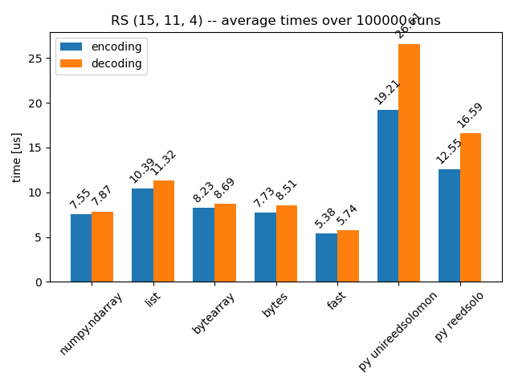

# pyreedsolomon
A high performance Python interface to the linux kernel Reed Solomon libraries

## Requirements
Userspace interface to the kernel Reed Solomon libraries and numpy
Source and build instructions on [https://github.com/tierney/reed-solomon](https://github.com/tierney/reed-solomon)

Recommendations for building the C-libraries:
   
To allow for symbol sizes larger than 8 bits uncomment in *configure.ac*:
```
AC_DEFINE(CONFIG_REED_SOLOMON_ENC16, 1, Reed Solomon encoding word length)
AC_DEFINE(CONFIG_REED_SOLOMON_DEC16, 1, Reed Solomon decoding word length)
```

configure with --prefix=/usr/ or add the location of *librs.so* is in your library path (*LD_LIBRARY_PATH*)

## Installation
pip install pyreedsolomon

## Usage
This library provides fast methods where the user needs to allocate the buffers and handle padding as well as easy-to-use methods that have a slightly lower performance

```python
import pyreedsolomon
import numpy as np

rs_dr = pyreedsolomon.Reed_Solomon(8,223,255,0x11D,0,1,32)

data = np.random.randint(0,256,150).astype(np.uint8)

data_enc = rs_dr.encode(data)

# create a few errors
err_idx = [23,53,12,97,102, 200, 250]


data_enc[err_idx] = 255

data_dec, n_errors = rs_dr.decode(data_enc)

verify = np.all(data_dec[-len(data):]==data)

print(f"Decoding succes: {verify}. errors corrected {n_errors}")
```

For more examples including how to use the fast encoder and decoder that omits variable checking, check tests/bench.py

## Performance
Performance comparison of *pyreedsolomon* with different input data types and comparison to *unireedsolomon* and *reedsolo*
Input data types supported:

 * numpy.ndarray
 * list
 * bytes
 * bytearray

Test run on *Intel(R) Core(TM) i7-3770 CPU @ 3.40GHz*

RS (973, 935, 10) -- encoding and decoding 1000 runs

| test name | encoding | decoding |num errors|
| :-------- | -------: | -------: | :------: |
|dtype numpy.ndarray   | 0.081 s 0.081 ms each | 0.077 s 0.077 ms each | 0 | 
|dtype list            | 0.173 s 0.173 ms each | 0.147 s 0.147 ms each | 0 |
|dtype bytearray       | 0.082 s 0.082 ms each | 0.079 s 0.079 ms each | 0 |
|dtype bytes           | 0.080 s 0.080 ms each | 0.078 s 0.078 ms each | 0 |
|fast                  | 0.076 s 0.076 ms each | 0.073 s 0.073 ms each | 0 |
|py unireedsolomon     | 10.175 s 10.175 ms each | 8.111 s 8.111 ms each | 0|

RS (255, 223, 8) -- encoding and decoding 10000 runs

| test name | encoding | decoding |num errors|
| :-------- | -------: | -------: | :------: |
|dtype numpy.ndarray | 0.286 s 0.029 ms each |0.319 s 0.032 ms each   | 0|
|dtype list          | 0.475 s 0.048 ms each |0.542 s 0.054 ms each   | 0|
|dtype bytearray     | 0.277 s 0.028 ms each |0.356 s 0.036 ms each   | 0|
|dtype bytes         | 0.272 s 0.027 ms each |0.328 s 0.033 ms each   | 0|
|fast                | 0.232 s 0.023 ms each |0.280 s 0.028 ms each   | 0|
|py unireedsolomon   | 13.396 s 1.340 ms each| 13.963 s 1.396 ms each | 0|
|py reedsolo         | 12.086 s 1.209 ms each| 24.035 s 2.404 ms each | 0|

RS (15, 11, 4) -- encoding and decoding 100000 runs

| test name | encoding | decoding |num errors|
| :-------- | -------: | -------: | :------: |
|dtype numpy.ndarray  | 1.365 s 0.014 ms each | 1.453 s 0.015 ms each | 0|
|dtype list           | 1.759 s 0.018 ms each | 1.900 s 0.019 ms each | 0|
|dtype bytearray      | 1.452 s 0.015 ms each | 1.613 s 0.016 ms each | 0|
|dtype bytes          | 1.409 s 0.014 ms each | 1.521 s 0.015 ms each | 0|
|fast                 | 1.069 s 0.011 ms each | 1.015 s 0.010 ms each | 0|
|py unireedsolomon    | 2.626 s 0.026 ms each | 4.015 s 0.040 ms each | 0|
|py reedsolo          | 1.991 s 0.020 ms each | 2.753 s 0.028 ms each | 0|





